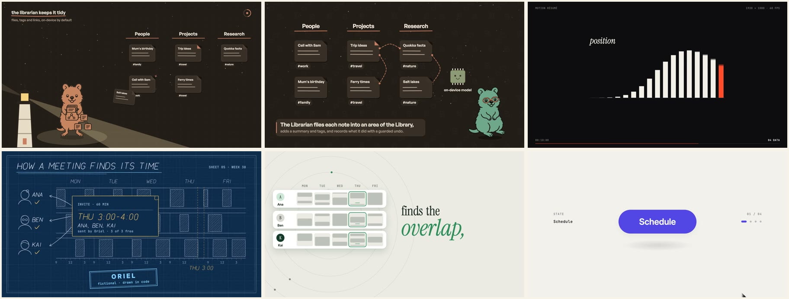

<div align="center">

<picture>
  <source media="(prefers-color-scheme: dark)" srcset="docs/media/quokka-waving.inv.svg">
  
</picture>

# rotli studio

### Films drawn in code. Every prompt kept.

The open-source studio behind Rotli's films, story episodes, shorts and carousels. Every frame is a
function in code, every piece keeps the brief, the prompt and the agent run that made it, and nothing
about the engine is Rotli-only.

[**Watch at studio.rotli.co**](https://studio.rotli.co) &nbsp;·&nbsp; [rotli.co](https://rotli.co)
&nbsp;·&nbsp; MIT licence

<br>



</div>

---

## What's here

| Series | What it is |
|---|---|
| **The Rotli Story** | The first film: a quokka on Rottnest, from the ferry to the sunset. 60 s, sealed. |
| **Season One: The Island Keeps Everything** | Ten one-minute story episodes, each cut into a vertical, a carousel and a card. |
| **Rotli in 30 Seconds** | Eight feature explainers, one feature each, shown in the app. |
| **Looks and Themes** | Shorts and stills about the companion's looks and the app's theme environments. |
| **Explainer Carousels** | Standalone carousels: how Rotli works in four slides, and how its film was drawn in code. |
| **Atmosphere Reel** | Every mood a scene can be set in, three seconds each. |
| **Studies** | Pieces for a fictional product, **Oriel**, in 21 styles and every size: kinetic type, particles, data, geometry, print, blueprint, floating UI, founder-explainer reels (caption ladders, isometric stacks, pixel parables, paper collage, agent maps, dot grids, before/after) and a one-take morph launch. They show the studio is not only Rotli's. |

Every piece opens down to its scenes, the cuts made from it, its brief, its exact prompt, the agent run
that built it (prompt, follow-ups, report, cost), its source and its golden: the hashes that prove it
still renders the same pixels. Every piece downloads ready to post: the video, or all its slides in one zip,
and its caption. The **Carousels** page gathers every slide post in one place.

## How a piece is made

1. **A brief.** A JSON file holds the story, the look, the scenes and every claim a caption may make.
2. **A prompt.** The brief plus a shared preamble becomes the agent's prompt, deterministically.
3. **A build.** The piece is drawn in code on the studio's engine (by a person or an agent), checked on
   contact sheets as it goes.
4. **A review.** No dead air, no overlaps, claims that match the product, loudness around −16 LUFS.
5. **A golden.** Sampled frames and the audio are hashed, so any later change shows exactly what moved.

Sound is composed in code too: the studio's own music and effects live in [`sound/`](sound/) with the prompt
for each one.

## Use it for your product

Or skip the studio entirely: the **Prompt library** on [studio.rotli.co](https://studio.rotli.co) has a portable
prompt for every study. Paste one into Claude and get a single HTML file in that style, with nothing to install.

Point the studio at your own brand with a **brand pack** (palettes, fonts with their licences) and the
brand-neutral kit: sizes as data (landscape, vertical, square, portrait), springs, kinetic type, caption ladders, UI,
depth, motion blur and a beat score. Start with the studies and
[`docs/use-it-for-your-product.md`](docs/use-it-for-your-product.md).

## Run it

Needs [Bun](https://bun.sh), Node 20+, `ffmpeg` and a Playwright Chromium.

```sh
bun install
(cd motion && npm install)
bun start                     # http://127.0.0.1:4500
```

Or double-click **`Open rotli studio.command`** on a Mac. The server listens on `127.0.0.1` only.

```sh
cd motion
node tools/studio.mjs list                 # every piece
node tools/studio.mjs render <id>          # render one (video, or carousel slides)
node tools/studio.mjs golden <id>          # prove it still renders the same
cd .. && bun run verify                    # every gate the studio has
```

## Create: social posts from templates

`/create` is a separate editor for posts built from HTML templates: statements, product shots, chat, notes,
Markdown side by side, points, a quokka, a call to action. Every template fits every format, and **Export
PNGs** writes each slide at its exact size (Instagram 4:5 and 1:1, Story 9:16, X 16:9, LinkedIn). Saved posts
are `posts/<slug>.json`; the brand library in `library/` is a snapshot of rotli's (refresh it with
`bun run sync`).

## Open, all the way down

- **MIT** for the studio. The render engine began as [anidoodle](https://github.com/alexgreensh/anidoodle)
  by Alex Greenshpun (Apache-2.0): its licence, NOTICE and the generated list of every file we changed are in
  [`motion/third_party/anidoodle/`](motion/third_party/anidoodle/). Fonts keep their own licences
  ([`NOTICE`](NOTICE)).
- **Public by design.** Synthetic data only. A privacy gate (`bun run check:public`) scans every pushed commit
  for secrets, personal paths, emails and private names, and the hosted snapshot is scanned again before it
  is built.
- **Deployed on merge.** Every push to `main` runs the gates and deploys [studio.rotli.co](https://studio.rotli.co)
  ([`deploy/README.md`](deploy/README.md)).

## Where to read next

| Doc | For |
|---|---|
| [`ARCHITECTURE.md`](ARCHITECTURE.md) | Where every kind of thing lives, and where anything new goes. |
| [`CONTRIBUTING.md`](CONTRIBUTING.md) | Setup, the gates, and what a good change looks like. |
| [`AGENTS.md`](AGENTS.md) | The rules AI agents follow here. |
| [`DESIGN.md`](DESIGN.md) | How the studio site looks and behaves. |
| [`motion/README.md`](motion/README.md) | The motion room: engine, tools, series. |
| [`docs/use-it-for-your-product.md`](docs/use-it-for-your-product.md) | Adapting the studio to your brand. |
| [`SECURITY.md`](SECURITY.md) | Reporting a problem privately. |
| [`CHANGELOG.md`](CHANGELOG.md) | What changed, and when. |
